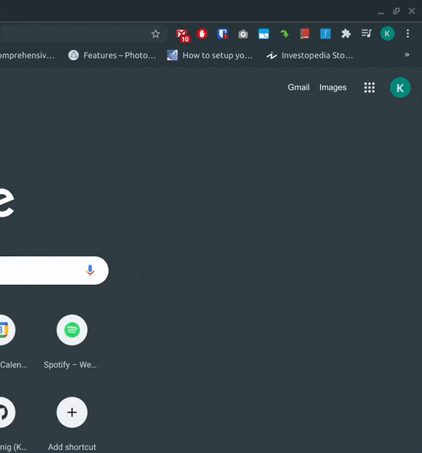

# SimplyMath

A Google Chrome plugin allowing WYSIWYG equation editing via MathQuill within Google Docs.  
Created because my friends and I needed something fast to type equations in that was also easy for assignment/exam markers to grade.

## Table of contents

- [Getting started](#getting-started)
- [Installation](#installation)
- [Usage](#usage)

## Getting started

- Install Node.js.
- Clone this repository using Git.
- Execute `npm install` to install the dependencies in package.json.
- Execute `npm run dev` to bundle the development build (output to the `build` folder).
- Execute `npm run prod` to bundle the production build (output to the `dist` folder).

## Installation

1. Open Google Chrome.
2. Navigate to <chrome://extensions>.
3. Turn on developer mode by clicking the toggle button in the top right corner.
4. Click on "Load unpacked".
5. Navigate to and select either the `build` or `dist` folder you created earlier.
6. Go to the extensions toolbar and click on the blue icon with an integral on it (the SimplyMath logo) and begin using the extension for all your browser based math equation needs.

## Usage

